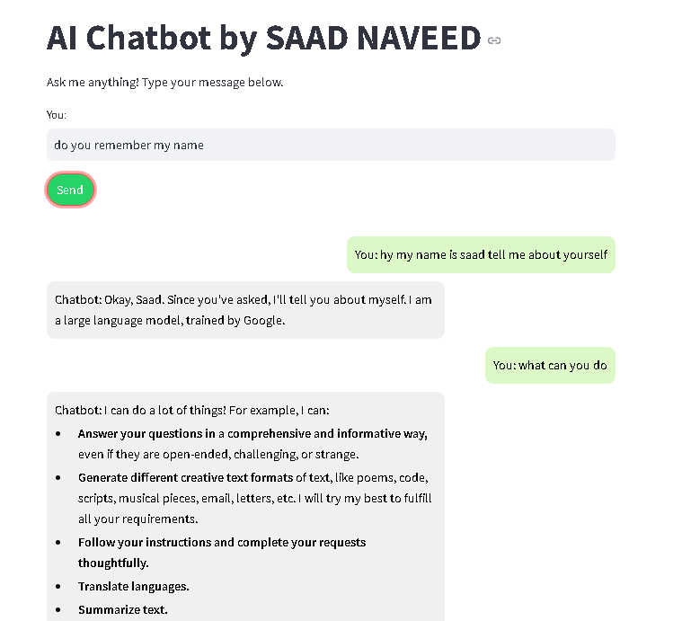

# AI Chatbot by Saad Naveed  

This project is a simple AI chatbot built with **Streamlit** and **Google Gemini API**. The chatbot allows users to ask questions, and it responds with AI-generated answers. It also maintains a memory of previous interactions to provide context-aware responses.

---

## 📋 Features  

- **User-friendly Interface:** Simple, clean, and modern UI with styled chat bubbles.  
- **Memory Context:** Chatbot maintains memory of previous conversations to offer coherent responses.  
- **Streamlit Integration:** Runs as a web-based application using Streamlit.  
- **Google Gemini API:** Leverages the power of Google's Gemini API for natural language generation.  

---

## 🚀 Demo  

 

---

## 🛠️ Installation  

1. Clone the repository:  
   ```bash  
   git clone https://github.com/your-username/ai-chatbot  
   cd ai-chatbot  
   ```  

2. Install dependencies:  
   ```bash  
   pip install -r requirements.txt  
   ```  

3. Run the Streamlit app:  
   ```bash  
   streamlit run chatbot.py  
   ```  

4. Open the URL displayed in the terminal (e.g., `http://localhost:8501`).  

---

## 📦 Dependencies  

- **Python 3.8+**  
- **Streamlit**  
- **Google Gemini API (genai)**  

To install all dependencies, ensure your `requirements.txt` file includes:  
```text  
streamlit  
google-genai  
```  

---

## 🔑 Setting Up Your API Key  

To use this chatbot, you will need a valid Google Gemini API key. Follow these steps:  

1. Obtain your API key from [Google Cloud Console](https://console.cloud.google.com/).  
2. Replace the placeholder `YOUR_VALID_API_KEY` in `chatbot.py` with your actual API key:  
   ```python  
   client = genai.Client(api_key="YOUR_VALID_API_KEY")  
   ```  

---

## 📖 How to Use  

1. Run the app using `streamlit run chatbot.py`.  
2. Type your questions in the input box.  
3. Click "Send" to get responses from the chatbot.  
4. The conversation will display as chat bubbles for easy readability.  

---

## 🖌️ Styling  

Custom CSS is used for the chat bubbles and buttons to enhance the user interface. Feel free to modify the styles in the `st.markdown()` section of the code to suit your preferences.  

---

## 🛑 Common Issues  

**API Key Invalid Error:**  
- Ensure you are using a valid Google Gemini API key.  
- Make sure the *Generative Language API* is enabled for your project in Google Cloud Console.  

**Numpy Import Errors:**  
- If you encounter import issues, try reinstalling the necessary libraries:  
  ```bash  
  pip install numpy --upgrade  
  ```  

---

## 💡 Future Improvements  

- Add speech-to-text and text-to-speech capabilities.  
- Implement multi-language support.  
- Enable sentiment analysis for better conversational flow.  

---

## 📄 License  

This project is licensed under the MIT License.  

---

## 📞 Contact  

For any questions or support, feel free to reach out!  

- **Author:** Saad Naveed  
- **Email:** [saad.naveed.dev@gmail.com]  
- **GitHub:** [Your GitHub Profile](https://github.com/saadnaveeddev)  

